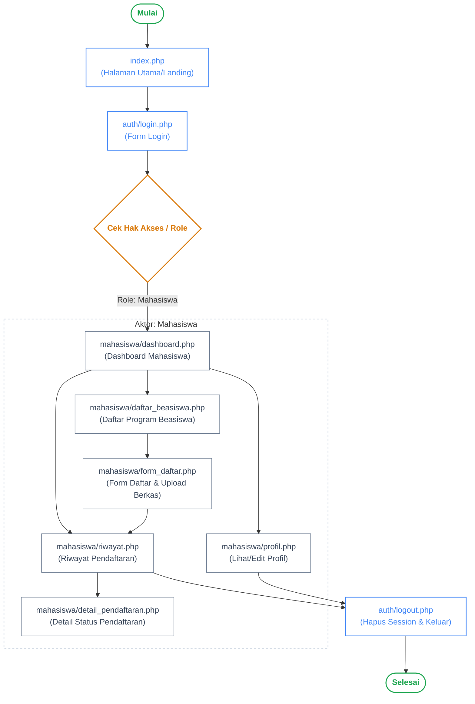
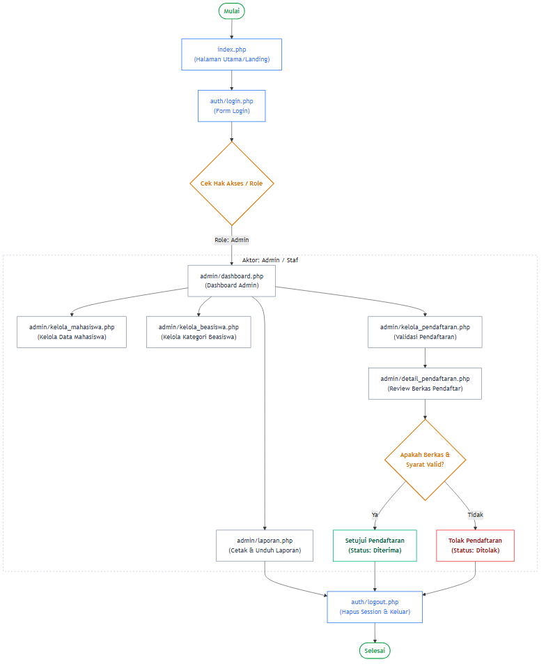
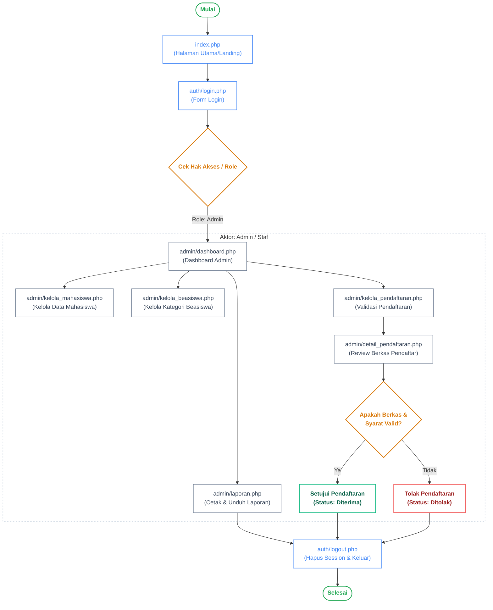
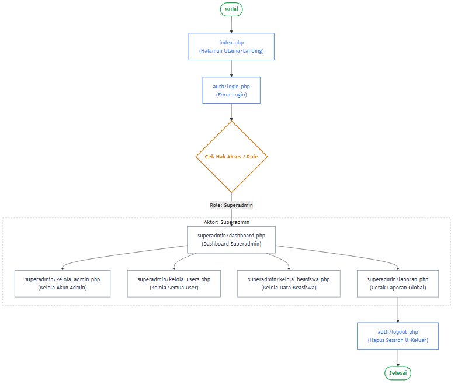

# Diagram Aktivitas Sistem Beasiswa

Berikut adalah diagram aktivitas sistem beasiswa yang dibagi menjadi 3 berdasarkan hak akses (Role) agar gambar tidak pecah saat diexport menjadi PNG.

---

## 1. Halaman Aktivitas - Mahasiswa




---

## 2. Halaman Aktivitas - Admin / Staf





---

## 3. Halaman Aktivitas - Superadmin



```mermaid
flowchart TD
    %% Main Flow Initiation
    Start([Mulai]) --> Index["index.php<br>(Halaman Utama/Landing)"]
    Index --> Login["auth/login.php<br>(Form Login)"]
    Login --> DecRole{"Cek Hak Akses / Role"}
    DecRole -->|Role: Superadmin| S_Dash["superadmin/dashboard.php<br>(Dashboard Superadmin)"]

    %% Subgraph Superadmin
    subgraph Superadmin ["Aktor: Superadmin"]
        S_Dash --> S_Adm["superadmin/kelola_admin.php<br>(Kelola Akun Admin)"]
        S_Dash --> S_Usr["superadmin/kelola_users.php<br>(Kelola Semua User)"]
        S_Dash --> S_Bea["superadmin/kelola_beasiswa.php<br>(Kelola Data Beasiswa)"]
        S_Dash --> S_Lap["superadmin/laporan.php<br>(Cetak Laporan Global)"]
    end

    %% Logout Flow
    Logout["auth/logout.php<br>(Hapus Session & Keluar)"]
    S_Lap --> Logout
    Logout --> Stop([Selesai])

    %% Styling Definitions
    classDef startEnd fill:none,stroke:#16A34A,stroke-width:2px,color:#16A34A,font-weight:bold;
    classDef auth fill:none,stroke:#3B82F6,stroke-width:1.5px,color:#3B82F6;
    classDef decision fill:none,stroke:#D97706,stroke-width:2px,color:#D97706,font-weight:bold;
    classDef flowNode fill:none,stroke:#64748B,stroke-width:1px,color:#334155;

    %% Assigning Classes to Nodes
    class Start,Stop startEnd;
    class Index,Login,Logout auth;
    class DecRole decision;
    class S_Dash,S_Adm,S_Usr,S_Bea,S_Lap flowNode;

    %% Subgraph Styling
    style Superadmin fill:none,stroke:#CBD5E1,stroke-width:1.5px,stroke-dasharray: 4 4;
```
